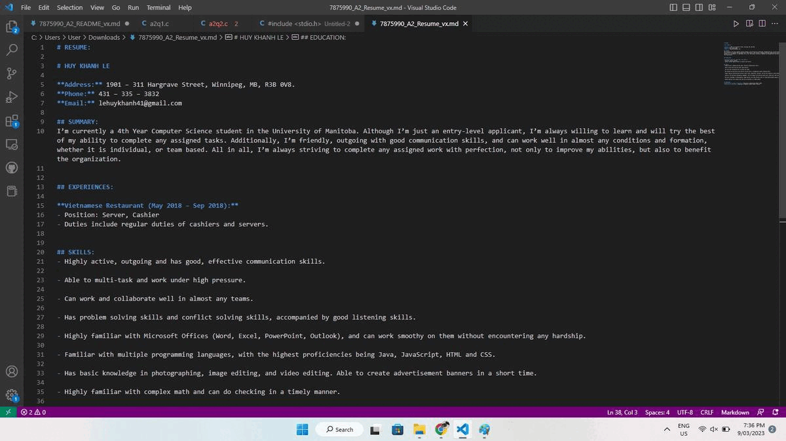
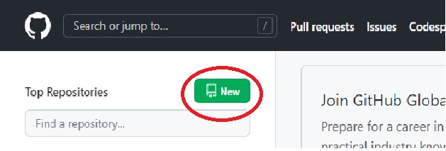

# HOW TO HOST YOUR RESUME ON GIT HUB PAGE WITH THE AID OF JEKYLL

This document is made to show how to host your resume on an online website. In short, in order to to this, you will need to use Markdown, Git Hub and Jekyll. The practical step-by-step process about how to accomplish this will be shown below.

# PREREQUISITE

- Knowledge about Markdown. Please checkout [this link](https://www.markdowntutorial.com/) to learn about Markdown and Markdown formatting.

- Here is an example of a formatted resume, [in-code](./img/formatting.jpg) and [in-reality](./img/finalize.jpg).

- It is better if you have already known Visual Studio Code. Otherwise, any text editor apps work just fine.

# STEPS TO DO IT:

## STEP 1: CHOOSE YOUR MARKDOWN EDITOR:

- It is highly recommended that you use **Visual Studio Code** thanks to its versatility. You can download it [here](https://code.visualstudio.com/download). Otherwise, if you have already acquaintainted to a particular text editor, check if that editor supports Markdown. Otherwise, I would recommend using **Visual Studio Code.**

**SIDE TIPS: HOW TO INCLUDE A .GIF ANIMATED IMAGE IN YOUR MARKDOWN?**

- You should have that gif on your device already. Then use this syntax:
``` ```

For example:

``` ```



## STEP 2: FORMAT YOUR RESUME:

- Assuming you have already had your resume (in Word, in PDF, in a text file,...); copy it into your Markdown text editor.

- Format it following the Markdown syntaxs that you have learnt in the ***Prerequisite*** section. Look at it a few times. You can even copy your whole text to an online Markdown viewer website to see how your resume would turn out after it is finalized. 

- Once you are satistifed with the result, save the resume Markdown file as a new file, and we will proceed to the next step.

## STEP 3: GETTING TO KNOW JEKYLL:

Jekyll is a tool that automatically helps you to set up a website, even when you don't have much programming experiences with it. Believe it or not, even without any knowledge in HTML, JavaScript or CSS, you can still bring your resume onto an online website of your own with the help of Jekyll.

So, let's get started.

**STEP 3.1: INSTALL JEKYLL:**

- Please check out [this link](https://jekyllrb.com/docs/installation/) to see Jekyll's installation manual.

- Please note that installing Ruby is extremely crucial, so please don't skip this step. Otherwise, you program will be heavily bugged and will be un-runnable.

**STEP 3.2: LEARN JEKYLL:**

- Please see [this link](https://www.youtube.com/playlist?list=PLLAZ4kZ9dFpOPV5C5Ay0pHaa0RJFhcmcB) for a series of lessons including Jekyll. They are just very short videos (< 8 minutes), and are very easy to follow.

- It is highly recommended that you practice while watching the video, so that you will have a grip on what you are going to do.

**STEP 3.3: PSEUDO-DEPLOY YOUR RESUME:**

- After getting aquaintance to Jekyll, try to deploy your resume to see if it works. If it does, and everything is alright, we will proceed to Step 4.

## STEP 4: GETTING AQUAINTANCE WITH GIT HUB:

After step 3, you have probably got the acquaintance to Jekyll and have successfully deployed your resume. However, the website you had just created is just a local website - meaning, only you or anyone who has the file can see it. Other people cannot Google to search your website (yet). Therefore, in order to enable people to do so, we use GitHub - Which is the final step in launching your website online.

**STEP 4.1: CREATE A GIT HUB ACCOUNT:**

- Go to [GitHub](https://github.com/), and create your own account.

- Spend a few time to feel the website. Additionally, please check out the [short Git Hub tutorial here](https://www.youtube.com/watch?v=iv8rSLsi1xo), so that you will have a basic understanding in how Git Hub works.

**STEP 4.2: CREATE YOUR OWN REPOSITORY:**

For now, a repository is a place which act as an online storage for you to hold the files. 

- Create a new repository. Remember to set it as public.
;

**STEP 4.3: INTEGRATE JEKYLL WITH GIT HUB:**

- Please check out [this video](https://www.youtube.com/watch?v=fqFjuX4VZmU&list=PLLAZ4kZ9dFpOPV5C5Ay0pHaa0RJFhcmcB&index=19). After watching this, you should probably be able to set up that website.

- You will need to use the command line. In case you do not know how to initiate it, search for the "Terminal" app on your computer and open it.

## STEP 5: FINAL CHECK:

- Launch your website several times. Does it works smoothly? If yes, congratulations ! You had just created your own resume website.

# MORE RESOURCES:

- [Markdown Tutorial](https://www.markdowntutorial.com/)
- [Markdown Syntax Cheat Sheet](https://www.markdownguide.org/cheat-sheet/)
- [Andrew Etter's Modern Technical Writing](https://www.amazon.ca/Modern-Technical-Writing-Introduction-Documentation-ebook/dp/B01A2QL9SS)
- [Lessons for Jekyll](https://www.youtube.com/playlist?list=PLLAZ4kZ9dFpOPV5C5Ay0pHaa0RJFhcmcB)
- [Lessons for GitHub](https://www.youtube.com/watch?v=iv8rSLsi1xo)
- [GitHub Command Line Cheat Sheet](https://education.github.com/git-cheat-sheet-education.pdf)

# AUTHORS AND ACKNOWLEDGEMENT:

- [Jekyll Theme used in this README](https://github.com/jekyll/minima)
- Written by Khanh Le, COMP3040 - Group 5.

# FREQUENTLY ASKED QUESTIONS:

**1. Why is Markdown better than a word processor?**

The reason why we prefer Markdown is that Markdown allows formatting, while a word processor does not. With Markdown, you can bold text, add images, add hyperlinks,... and it function just like a miniature version of Microsoft Word. This helps a lot in dividing the post into sections, as well as make the post become more lively.

Word Processor, on the other hand, only gives plain text and can be inconvenient sometimes.

**2. Why is my resume not showing up?**

Did your website work? In the other words, can you Google your website and see that it exist? If the answer is no, the reason is probably lies in your GitHub page setting. Check again if your repository is public or not, and also check again if it has finished validating the file or not.

If the answer is yes, probably the connection between your Jekyll and your GitHub is having trouble. Go to the config.yml file in Jekyll, and makes sure that GitHub has already been included.
